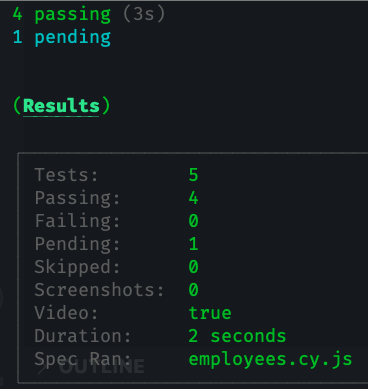

# Cypress Roche Test Project

This project contains automated tests using Cypress to perform end-to-end testing on a web application.

## Prerequisites

Make sure you have Node.js installed on your system. The recommended version is 16.18.1. You can download Node.js from the following link: <https://nodejs.org>

Installation
Clone this repository to your local machine:

`git clone <https://github.com/Edd1525/roche.git>`

Navigate to the project directory:

cd your-cypress-project
Install the project dependencies:

`npm install`

  Scripts to run the server and tests separately

`npm run cypress:open`: Opens the Cypress graphical interface to manually select and run tests.
`npm start`: Starts the HTTP server for the web application under test.
`npm test`: Runs the automated tests using Cypress in the Chrome browser.

## To run the server and tests please use this command!!

`npm run appTest` : Starts the HTTP server and runs the automated tests in parallel.
Running Tests
  To run the automated tests, make sure you have started the HTTP server using the npm start command.

**Adding execution proof**

